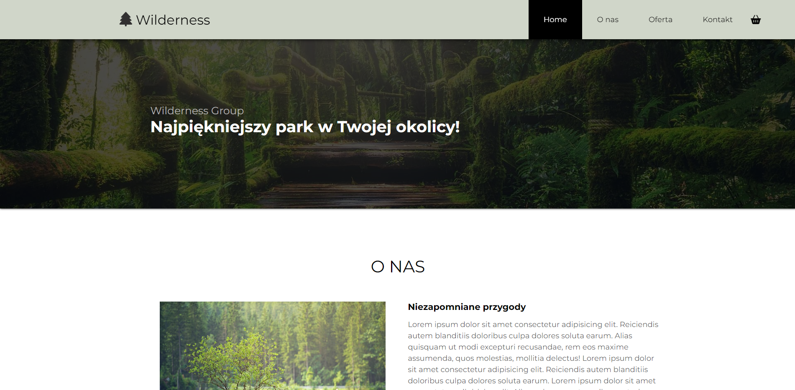
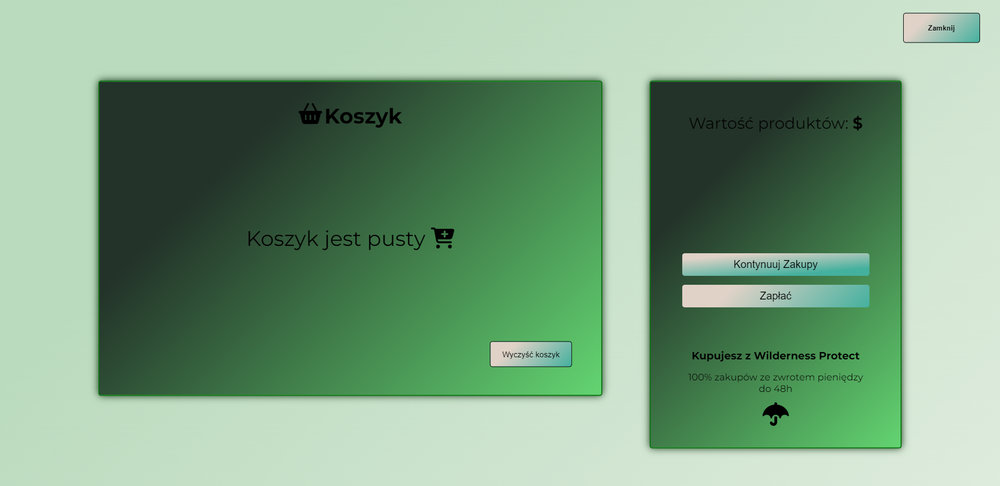

# Wilderness Website

**Hello!**

This is my **first** major project that I have created on my own.

You may have seen a similar design before, as the homepage was modelled on a mockup that was playable as a post-course assignment.

**The key word is similar.** I didn't stick rigidly to the mockup. **I tried to be creative** and add something from myself. **You can add the selected product to the basket and simulating the purchase of it.** 

I can assure you that the website is different from all its similar ones 😊

Unfortunately, at the moment it is only adapted for desktops.
In the future, when I gain more experience and skills I will want to adapt it for smaller resolutions as well!

## Screenshots

## 🔗 Live Site
[Live Here!](https://camillematernacci.github.io/Wilderness/)

